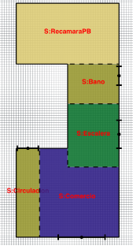
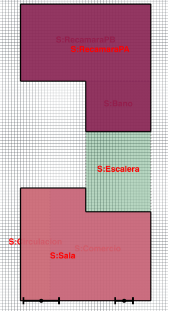
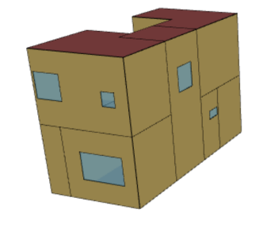
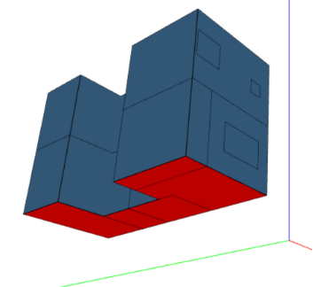

## Clima

* Templado húmedo (CONAVI, 2010 @noauthor_anexo_nodate)
* Zona térmica 3A, GDCA18.3=2351, GDRA10=4959 (CONUEE, 2021 @noauthor_gradosdia_2021)

```{python}
import plotly.graph_objects as go

from pvlib.iotools import read_epw

path = 'epw/MEX_CMX_Cuidad.Mexico.Central.766800_TMYx.2011-2025.epw'
weather, metadata = read_epw(path)

month_labels = ['Ene', 'Feb', 'Mar', 'Abr', 'May', 'Jun', 'Jul', 'Ago', 'Sep', 'Oct', 'Nov', 'Dic']
monthly_temperature = [weather.loc[weather.index.month == month, 'temp_air'] for month in range(1, 13)]
monthly_mean = weather['temp_air'].groupby(weather.index.month).mean().reindex(range(1, 13))

fig = go.Figure()
for month_label, temperatures in zip(month_labels, monthly_temperature):
    color = 'gray'
    linecol = 'gray'
    if month_label == 'Ene':
        color = 'blue' 
        linecol = 'blue'
    if month_label == 'May':
        color = 'crimson'
        linecol = 'crimson'
    fig.add_trace(go.Box(
        y=temperatures,
        name=month_label,
        marker_color=color,
        line_color=linecol,
    ))

fig.add_trace(go.Scatter(
    x=month_labels,
    y=monthly_mean.values,
    name='Tma',
))

fig.update_layout(
    yaxis_title='To [°C]',
)
```

## GHD @humphreys_outdoor_2000, @morillon_galvez_atlas_2004

```{python}
from pvlib.iotools import read_epw
import pandas as pd
import numpy as np
import plotly.graph_objects as go

f = "epw/MEX_CMX_Cuidad.Mexico.Central.766800_TMYx.2011-2025.epw"
weather, metadata = read_epw(f)

gdc_base_f = 65
gdr_base_f = 50
gdc_base_c = (gdc_base_f - 32) * 5 / 9
gdr_base_c = (gdr_base_f - 32) * 5 / 9

# Use monthly mean of daily min/max instead of absolute monthly min/max
daily_extremos = weather['temp_air'].groupby(weather.index.floor('D')).agg(['min', 'max'])
temp_min_mensual = daily_extremos['min'].groupby(daily_extremos.index.month).mean()
temp_max_mensual = daily_extremos['max'].groupby(daily_extremos.index.month).mean()

estadisticas_mensuales = pd.DataFrame({
    'temp_media': weather['temp_air'].groupby(weather.index.month).mean(),
    'temp_min': temp_min_mensual,
    'temp_max': temp_max_mensual,
})
meses_es = ['Ene', 'Feb', 'Mar', 'Abr', 'May', 'Jun', 'Jul', 'Ago', 'Sep', 'Oct', 'Nov', 'Dic']
estadisticas_mensuales.index = [meses_es[i - 1] for i in estadisticas_mensuales.index]

estadisticas_mensuales["Tn"] = 13.5 + .54 * estadisticas_mensuales["temp_media"]

estadisticas_mensuales["DeltaTa"] = estadisticas_mensuales["temp_max"] - estadisticas_mensuales["temp_min"]

conditions = [
    estadisticas_mensuales['DeltaTa'] < 16,
    (estadisticas_mensuales['DeltaTa'] >= 16) & (estadisticas_mensuales['DeltaTa'] < 19),
    (estadisticas_mensuales['DeltaTa'] >= 19) & (estadisticas_mensuales['DeltaTa'] < 24),
    estadisticas_mensuales['DeltaTa'] >= 24,
]
choices = [1.5, 3.5 / 2, 2, 4.5 / 2]
estadisticas_mensuales['banda'] = np.select(conditions, choices, default=np.nan)

estadisticas_mensuales["Tn_sup"] = estadisticas_mensuales["Tn"] + estadisticas_mensuales["banda"]
estadisticas_mensuales['Tn_inf'] = estadisticas_mensuales["Tn"] - estadisticas_mensuales["banda"]

# Hourly clipped differences using monthly comfort limits
temp_air = weather['temp_air']
mes_hora = pd.Series(weather.index.month, index=weather.index).map(lambda m: meses_es[m - 1])
tn_inf_h = mes_hora.map(estadisticas_mensuales['Tn_inf'])
tn_sup_h = mes_hora.map(estadisticas_mensuales['Tn_sup'])

dif_temp_tninf_h = (temp_air - tn_inf_h).clip(lower=0)
dif_tnsup_temp_h = (tn_sup_h - temp_air).clip(lower=0)

estadisticas_mensuales['GHDF'] = dif_temp_tninf_h.groupby(mes_hora).sum().reindex(estadisticas_mensuales.index)
estadisticas_mensuales['GHDC'] = dif_tnsup_temp_h.groupby(mes_hora).sum().reindex(estadisticas_mensuales.index)

# Safe normalization: create a one-year hourly index and assign to a copy
tz = weather.index.tz
new_index = pd.date_range(start=pd.Timestamp('2000-01-01', tz=tz), periods=len(weather), freq='h')
weather_one_year = weather.copy()
weather_one_year.index = new_index

# Map monthly Tn_inf/Tn_sup to the normalized one-year index and compute masks and GHDF/GHDC
mes_hora_one = pd.Series(weather_one_year.index.month, index=weather_one_year.index).map(lambda m: meses_es[m-1])
tn_inf_h_one = mes_hora_one.map(estadisticas_mensuales['Tn_inf'])
tn_sup_h_one = mes_hora_one.map(estadisticas_mensuales['Tn_sup'])

# Boolean masks
confort = (weather_one_year['temp_air'] >= tn_inf_h_one) & (weather_one_year['temp_air'] <= tn_sup_h_one)
calor = weather_one_year['temp_air'] > tn_sup_h_one
frio = weather_one_year['temp_air'] < tn_inf_h_one

# Monthly aggregated GHDF / GHDC based on one-year index
dif_temp_tninf_h_one = (weather_one_year['temp_air'] - tn_inf_h_one).clip(lower=0)
dif_tnsup_temp_h_one = (tn_sup_h_one - weather_one_year['temp_air']).clip(lower=0)

ghdf_one = dif_temp_tninf_h_one.groupby(mes_hora_one).sum().reindex(estadisticas_mensuales.index)
ghdc_one = dif_tnsup_temp_h_one.groupby(mes_hora_one).sum().reindex(estadisticas_mensuales.index)

estadisticas_mensuales['GHDF_one'] = ghdf_one
estadisticas_mensuales['GHDC_one'] = ghdc_one

# Plot using bounds derived from the updated monthly mean daily min/max in estadisticas_mensuales
mes_hora_one = pd.Series(weather_one_year.index.month, index=weather_one_year.index).map(lambda m: meses_es[m - 1])
tn_inf_h_one = mes_hora_one.map(estadisticas_mensuales['Tn_inf'])
tn_sup_h_one = mes_hora_one.map(estadisticas_mensuales['Tn_sup'])

confort = (weather_one_year['temp_air'] >= tn_inf_h_one) & (weather_one_year['temp_air'] <= tn_sup_h_one)
calor = weather_one_year['temp_air'] > tn_sup_h_one
frio = weather_one_year['temp_air'] < tn_inf_h_one

fig = go.Figure()
fig.add_trace(go.Scatter(
    x=tn_sup_h_one.index,
    y=tn_sup_h_one.values,
    name='Tn_sup',
    line=dict(color='red'),
))
fig.add_trace(go.Scatter(
    x=tn_inf_h_one.index,
    y=tn_inf_h_one.values,
    name='Tn_inf',
    line=dict(color='blue'),
))

fig.add_trace(go.Scatter(
    x=weather_one_year.index[calor],
    y=weather_one_year['temp_air'][calor],
    mode='markers',
    name='To > Tn_sup',
    marker=dict(color='red', size=3),
))
fig.add_trace(go.Scatter(
    x=weather_one_year.index[confort],
    y=weather_one_year['temp_air'][confort],
    mode='markers',
    name='Tn_inf <= To <= Tn_sup',
    marker=dict(color='green', size=3),
))
fig.add_trace(go.Scatter(
    x=weather_one_year.index[frio],
    y=weather_one_year['temp_air'][frio],
    mode='markers',
    name='To < Tn_inf',
    marker=dict(color='blue', size=3),
))

fig.update_layout(
    yaxis_title='To [ºC]',
)
```

## Caso base

:::: {.columns}
::: {.column width="50%"}


:::
::: {.column width="50%"}


:::
::::

## Estrategias

| Estrategia | Descripción | Cambio con respecto a CB |
| --- | --- | --- |
| Color oscuro envolvente | Se aumentó la absortancia del mortero e impermeabilizante para aumentar la absorción de radiación solar. | alpha: 0.4 -> 0.7 @noauthor_absorbed_nodate |
| Adobe | Se reemplaza tabique por adobe en muros interiores y exteriores para aumentar la masa térmica y mejorar la capacidad de almacenamiento de calor, lo que puede ayudar a mantener temperaturas interiores más estables. | k: 0.7 -> 0.58, rho: 1970 - > 1500, c: 800 -> 1480 @noauthor_validacion_enerhabitatnotebookmaterialsini_nodate |
| Ventilación diurna | Se implementa un sistema de ventilación que permite la entrada de aire fresco durante el día para reducir la temperatura interior, especialmente durante las horas más calurosas. | Base: 0.5 CAH. 10:00-18:00: 5 CAH |    

## Resultados

```{python}
import plotly.graph_objects as go
import pandas as pd
import matplotlib.pyplot as plt
from iertools.read import read_sql
from dateutil.parser import parse

areas = {"BANO":1.7*2.2, "CIRCULACION":3.7, "COMERCIO":3.4*3+1.2*0.7, "ESCALERA":2.2*2.7, "RECAMARAPA":2.6*4.4+1.7*2.2, "RECAMARAPB":2.6*4.4, "SALA":4.4*3.7}
pesos = {nombre: area / sum(areas.values()) for nombre, area in areas.items()}

f = "osm/013_modificacion/run/eplusout.sql"
cb = read_sql(f,alias=True)
data_cb = cb.data
temps = data_cb.copy()
temps["Ti_CB"] = sum(temps[f"Ti_{zona}"] * peso for zona, peso in pesos.items())

f = "osm/016_adobe/run/eplusout.sql"
adobe = read_sql(f,alias=True)
data_adobe = adobe.data
temps["Ti_adobe"] = sum(data_adobe[f"Ti_{zona}"] * peso for zona, peso in pesos.items())

f = "osm/021_ventilacion_diurna/run/eplusout.sql"
ventilacion_diurna = read_sql(f,alias=True)
data_ = ventilacion_diurna.data
temps["Ti_ventilacion_diurna"] = sum(data_[f"Ti_{zona}"] * peso for zona, peso in pesos.items())

f = "osm/020_a0p7/run/eplusout.sql"
a0p7 = read_sql(f,alias=True)
data_ = a0p7.data
temps["Ti_a0p7"] = sum(data_[f"Ti_{zona}"] * peso for zona, peso in pesos.items())

f = "osm/022_3edb/run/eplusout.sql"
edb = read_sql(f,alias=True)
data_ = edb.data
temps["Ti_edb"] = sum(data_[f"Ti_{zona}"] * peso for zona, peso in pesos.items())

Tma = temps.To["2006-01-01":"2006-01-31"].mean()
Tmin = temps.To["2006-01-01":"2006-01-31"].resample("D").min().mean()
Tmax = temps.To["2006-01-01":"2006-01-31"].resample("D").max().mean()
DeltaTa = Tmax - Tmin
banda = 3.5 / 2
Tn = 13.5 + .54 * Tma
Tn_sup = Tn + banda
Tn_inf = Tn - banda

f1 = parse("2006-01-01")
f2 = f1 + pd.Timedelta(days=31)

fig = go.Figure()
fig.add_trace(go.Scatter(x=temps.index, y=temps.Ti_CB, mode='lines', name='Ti_CB'))
fig.add_trace(go.Scatter(x=temps.index, y=temps.Ti_adobe, mode='lines', name='Ti_adobe'))
fig.add_trace(go.Scatter(x=temps.index, y=temps.Ti_ventilacion_diurna, mode='lines', name='Ti_ventilacion_diurna'))
fig.add_trace(go.Scatter(x=temps.index, y=temps.Ti_a0p7, mode='lines', name='Ti_a0p7'))
fig.add_trace(go.Scatter(x=temps.index, y=temps.Ti_edb, mode='lines', name='Ti_edb'))
fig.add_trace(go.Scatter(x=temps.index, y=temps.To, mode='lines', name='To'))

# Horizontal Tn lines
fig.add_hline(y=float(Tn_sup), line=dict(color='red', width=2), annotation_text='Tn_sup', annotation_position='top right')
fig.add_hline(y=float(Tn), line=dict(color='green', width=2), annotation_text='Tn', annotation_position='top right')
fig.add_hline(y=float(Tn_inf), line=dict(color='blue', width=2), annotation_text='Tn_inf', annotation_position='top right')

# Limit x-range to the same window as before
fig.update_xaxes(range=[f1, f2])
```

## GHD

```{python}
from IPython.display import Markdown
from tabulate import tabulate
import plotly.graph_objects as go
import pandas as pd
import matplotlib.pyplot as plt
from iertools.read import read_sql
from dateutil.parser import parse

areas = {"BANO":1.7*2.2, "CIRCULACION":3.7, "COMERCIO":3.4*3+1.2*0.7, "ESCALERA":2.2*2.7, "RECAMARAPA":2.6*4.4+1.7*2.2, "RECAMARAPB":2.6*4.4, "SALA":4.4*3.7}
pesos = {nombre: area / sum(areas.values()) for nombre, area in areas.items()}

f = "osm/013_modificacion/run/eplusout.sql"
cb = read_sql(f,alias=True)
data_cb = cb.data
temps = data_cb.copy()
temps["Ti_CB"] = sum(temps[f"Ti_{zona}"] * peso for zona, peso in pesos.items())

f = "osm/016_adobe/run/eplusout.sql"
adobe = read_sql(f,alias=True)
data_adobe = adobe.data
temps["Ti_adobe"] = sum(data_adobe[f"Ti_{zona}"] * peso for zona, peso in pesos.items())

f = "osm/021_ventilacion_diurna/run/eplusout.sql"
ventilacion_diurna = read_sql(f,alias=True)
data_ = ventilacion_diurna.data
temps["Ti_ventilacion_diurna"] = sum(data_[f"Ti_{zona}"] * peso for zona, peso in pesos.items())

f = "osm/020_a0p7/run/eplusout.sql"
a0p7 = read_sql(f,alias=True)
data_ = a0p7.data
temps["Ti_a0p7"] = sum(data_[f"Ti_{zona}"] * peso for zona, peso in pesos.items())

f = "osm/022_3edb/run/eplusout.sql"
edb = read_sql(f,alias=True)
data_ = edb.data
temps["Ti_edb"] = sum(data_[f"Ti_{zona}"] * peso for zona, peso in pesos.items())

Tma = temps.To["2006-01-01":"2006-01-31"].mean()
Tmin = temps.To["2006-01-01":"2006-01-31"].resample("D").min().mean()
Tmax = temps.To["2006-01-01":"2006-01-31"].resample("D").max().mean()
DeltaTa = Tmax - Tmin
banda = 3.5 / 2
Tn = 13.5 + .54 * Tma
Tn_sup = Tn + banda
Tn_inf = Tn - banda
dt_h = 1 / 6

Tmax_ene = (temps.To["2006-01-01":"2006-01-31"]).resample("D").max().mean()
Tmax_CB_ene = (temps.Ti_CB["2006-01-01":"2006-02-01"]).resample("D").max().mean()
Tmax_a0p7_ene = (temps.Ti_a0p7["2006-01-01":"2006-02-01"]).resample("D").max().mean()
Tmax_adobe_ene = (temps.Ti_adobe["2006-01-01":"2006-02-01"]).resample("D").max().mean()
Tmax_ventilacion_diurna_ene = (temps.Ti_ventilacion_diurna["2006-01-01":"2006-02-01"]).resample("D").max().mean()
Tmax_edb_ene = (temps.Ti_edb["2006-01-01":"2006-02-01"]).resample("D").max().mean()

Tmin_ene = (temps.To["2006-01-01":"2006-01-31"]).resample("D").min().mean()
Tmin_CB_ene = (temps.Ti_CB["2006-01-01":"2006-02-01"]).resample("D").min().mean()
Tmin_a0p7_ene = (temps.Ti_a0p7["2006-01-01":"2006-02-01"]).resample("D").min().mean()
Tmin_adobe_ene = (temps.Ti_adobe["2006-01-01":"2006-02-01"]).resample("D").min().mean()
Tmin_ventilacion_diurna_ene = (temps.Ti_ventilacion_diurna["2006-01-01":"2006-02-01"]).resample("D").min().mean()
Tmin_edb_ene = (temps.Ti_edb["2006-01-01":"2006-02-01"]).resample("D").min().mean()

GHDC_ene = (temps.To["2006-01-01":"2006-01-31"] - Tn_sup).clip(lower=0).sum() * dt_h
GHDC_CB_ene = (temps.Ti_CB["2006-01-01":"2006-02-01"] - Tn_sup).clip(lower=0).sum() * dt_h
GHDC_a0p7_ene = (temps.Ti_a0p7["2006-01-01":"2006-02-01"] - Tn_sup).clip(lower=0).sum() * dt_h
GHDC_adobe_ene = (temps.Ti_adobe["2006-01-01":"2006-02-01"] - Tn_sup).clip(lower=0).sum() * dt_h
GHDC_ventilacion_diurna_ene = (temps.Ti_ventilacion_diurna["2006-01-01":"2006-02-01"] - Tn_sup).clip(lower=0).sum() * dt_h
GHDC_edb_ene = (temps.Ti_edb["2006-01-01":"2006-02-01"] - Tn_sup).clip(lower=0).sum() * dt_h

GHDF_ene = (Tn_inf - temps.To["2006-01-01":"2006-01-31"]).clip(lower=0).sum() * dt_h
GHDF_CB_ene = (Tn_inf - temps.Ti_CB["2006-01-01":"2006-02-01"]).clip(lower=0).sum() * dt_h
GHDF_a0p7_ene = (Tn_inf - temps.Ti_a0p7["2006-01-01":"2006-02-01"]).clip(lower=0).sum() * dt_h
GHDF_adobe_ene = (Tn_inf - temps.Ti_adobe["2006-01-01":"2006-02-01"]).clip(lower=0).sum() * dt_h
GHDF_ventilacion_diurna_ene = (Tn_inf - temps.Ti_ventilacion_diurna["2006-01-01":"2006-02-01"]).clip(lower=0).sum() * dt_h
GHDF_edb_ene = (Tn_inf - temps.Ti_edb["2006-01-01":"2006-02-01"]).clip(lower=0).sum() * dt_h

data = {
    "": [
        "Exterior", 
        "Caso base", 
        "Color oscuro", 
        "Adobe", 
        "Ventilación diurna", 
        "EDB"
    ],
    "GHDC": [
        GHDC_ene, 
        GHDC_CB_ene, 
        GHDC_a0p7_ene, 
        GHDC_adobe_ene, 
        GHDC_ventilacion_diurna_ene, 
        GHDC_edb_ene
    ],
    "GHDF": [
        GHDF_ene, 
        GHDF_CB_ene, 
        GHDF_a0p7_ene, 
        GHDF_adobe_ene, 
        GHDF_ventilacion_diurna_ene, 
        GHDF_edb_ene
    ],
    "Tmax [ºC]": [
        Tmax_ene, 
        Tmax_CB_ene, 
        Tmax_a0p7_ene, 
        Tmax_adobe_ene, 
        Tmax_ventilacion_diurna_ene, 
        Tmax_edb_ene
    ],
    "Tmin [ºC]": [
        Tmin_ene, 
        Tmin_CB_ene, 
        Tmin_a0p7_ene, 
        Tmin_adobe_ene, 
        Tmin_ventilacion_diurna_ene, 
        Tmin_edb_ene
    ]
}

# Generate the DataFrame
ghd = pd.DataFrame(data)
ghd.index = ghd[""]
ghd = ghd[["GHDC", "GHDF","Tmax [ºC]", "Tmin [ºC]"]]
ghd = ghd.round(2)
Markdown(tabulate(ghd, headers='keys'))
```

## Conclusiones

* Reducción GHDF CB -> 3 EDB: 1917.66
* Adobe: aunque individualmente disminuye Ti, disminuye amplitud oscilación junto con otras EDB de ganancia de calor
* Horario de ventilación diurna: depende de la temperatura exterior, pero en general mejora el confort térmico
* Limitaciones: sin cargas internas y sin masa térmica en escaleras

## Temperatura interior de cada zona

```{python}
import plotly.graph_objects as go
import pandas as pd
import matplotlib.pyplot as plt
from iertools.read import read_sql
from dateutil.parser import parse

areas = {"BANO":1.7*2.2, "CIRCULACION":3.7, "COMERCIO":3.4*3+1.2*0.7, "ESCALERA":2.2*2.7, "RECAMARAPA":2.6*4.4+1.7*2.2, "RECAMARAPB":2.6*4.4, "SALA":4.4*3.7}
pesos = {nombre: area / sum(areas.values()) for nombre, area in areas.items()}

f = "osm/013_modificacion/run/eplusout.sql"
cb = read_sql(f,alias=True)
data_cb = cb.data
temps = data_cb.copy()

f = "osm/016_adobe/run/eplusout.sql"
adobe = read_sql(f,alias=True)
data_adobe = adobe.data

f = "osm/021_ventilacion_diurna/run/eplusout.sql"
ventilacion_diurna = read_sql(f,alias=True)
data_ventilacion_diurna = ventilacion_diurna.data

f = "osm/020_a0p7/run/eplusout.sql"
a0p7 = read_sql(f,alias=True)
data_a0p7 = a0p7.data

f = "osm/022_3edb/run/eplusout.sql"
edb = read_sql(f,alias=True)
data_edb = edb.data

Tma = temps.To["2006-01-01":"2006-01-31"].mean()
Tmin = temps.To["2006-01-01":"2006-01-31"].resample("D").min().mean()
Tmax = temps.To["2006-01-01":"2006-01-31"].resample("D").max().mean()
DeltaTa = Tmax - Tmin
banda = 3.5 / 2
Tn = 13.5 + .54 * Tma
Tn_sup = Tn + banda
Tn_inf = Tn - banda

f1 = parse("2006-01-01")
f2 = f1 + pd.Timedelta(days=31)

fig = go.Figure()
fig.add_trace(go.Scatter(x=data_cb.index, y=data_cb.Ti_BANO, mode='lines', name='CB_BANO'))
fig.add_trace(go.Scatter(x=data_cb.index, y=data_cb.Ti_CIRCULACION, mode='lines', name='CB_CIRCULACION'))
fig.add_trace(go.Scatter(x=data_cb.index, y=data_cb.Ti_COMERCIO, mode='lines', name='CB_COMERCIO'))
fig.add_trace(go.Scatter(x=data_cb.index, y=data_cb.Ti_ESCALERA, mode='lines', name='CB_ESCALERA'))
fig.add_trace(go.Scatter(x=data_cb.index, y=data_cb.Ti_RECAMARAPA, mode='lines', name='CB_RECAMARAPA'))
fig.add_trace(go.Scatter(x=data_cb.index, y=data_cb.Ti_RECAMARAPB, mode='lines', name='CB_RECAMARAPB'))
fig.add_trace(go.Scatter(x=data_cb.index, y=data_cb.Ti_SALA, mode='lines', name='CB_SALA'))
fig.add_trace(go.Scatter(x=data_adobe.index, y=data_adobe.Ti_BANO, mode='lines', name='adobe_BANO'))
fig.add_trace(go.Scatter(x=data_adobe.index, y=data_adobe.Ti_CIRCULACION, mode='lines', name='adobe_CIRCULACION'))
fig.add_trace(go.Scatter(x=data_adobe.index, y=data_adobe.Ti_COMERCIO, mode='lines', name='adobe_COMERCIO'))
fig.add_trace(go.Scatter(x=data_adobe.index, y=data_adobe.Ti_ESCALERA, mode='lines', name='adobe_ESCALERA'))
fig.add_trace(go.Scatter(x=data_adobe.index, y=data_adobe.Ti_RECAMARAPA, mode='lines', name='adobe_RECAMARAPA'))
fig.add_trace(go.Scatter(x=data_adobe.index, y=data_adobe.Ti_RECAMARAPB, mode='lines', name='adobe_RECAMARAPB'))
fig.add_trace(go.Scatter(x=data_adobe.index, y=data_adobe.Ti_SALA, mode='lines', name='adobe_SALA'))
fig.add_trace(go.Scatter(x=data_ventilacion_diurna.index, y=data_ventilacion_diurna.Ti_BANO, mode='lines', name='ventilacion_diurna_BANO'))
fig.add_trace(go.Scatter(x=data_ventilacion_diurna.index, y=data_ventilacion_diurna.Ti_CIRCULACION, mode='lines', name='ventilacion_diurna_CIRCULACION'))
fig.add_trace(go.Scatter(x=data_ventilacion_diurna.index, y=data_ventilacion_diurna.Ti_COMERCIO, mode='lines', name='ventilacion_diurna_COMERCIO'))
fig.add_trace(go.Scatter(x=data_ventilacion_diurna.index, y=data_ventilacion_diurna.Ti_ESCALERA, mode='lines', name='ventilacion_diurna_ESCALERA'))
fig.add_trace(go.Scatter(x=data_ventilacion_diurna.index, y=data_ventilacion_diurna.Ti_RECAMARAPA, mode='lines', name='ventilacion_diurna_RECAMARAPA'))
fig.add_trace(go.Scatter(x=data_ventilacion_diurna.index, y=data_ventilacion_diurna.Ti_RECAMARAPB, mode='lines', name='ventilacion_diurna_RECAMARAPB'))
fig.add_trace(go.Scatter(x=data_ventilacion_diurna.index, y=data_ventilacion_diurna.Ti_SALA, mode='lines', name='ventilacion_diurna_SALA'))
fig.add_trace(go.Scatter(x=data_a0p7.index, y=data_a0p7.Ti_BANO, mode='lines', name='a0p7_BANO'))
fig.add_trace(go.Scatter(x=data_a0p7.index, y=data_a0p7.Ti_CIRCULACION, mode='lines', name='a0p7_CIRCULACION'))
fig.add_trace(go.Scatter(x=data_a0p7.index, y=data_a0p7.Ti_COMERCIO, mode='lines', name='a0p7_COMERCIO'))
fig.add_trace(go.Scatter(x=data_a0p7.index, y=data_a0p7.Ti_ESCALERA, mode='lines', name='a0p7_ESCALERA'))
fig.add_trace(go.Scatter(x=data_a0p7.index, y=data_a0p7.Ti_RECAMARAPA, mode='lines', name='a0p7_RECAMARAPA'))
fig.add_trace(go.Scatter(x=data_a0p7.index, y=data_a0p7.Ti_RECAMARAPB, mode='lines', name='a0p7_RECAMARAPB'))
fig.add_trace(go.Scatter(x=data_a0p7.index, y=data_a0p7.Ti_SALA, mode='lines', name='a0p7_SALA'))
fig.add_trace(go.Scatter(x=data_edb.index, y=data_edb.Ti_BANO, mode='lines', name='edb_BANO'))
fig.add_trace(go.Scatter(x=data_edb.index, y=data_edb.Ti_CIRCULACION, mode='lines', name='edb_CIRCULACION'))
fig.add_trace(go.Scatter(x=data_edb.index, y=data_edb.Ti_COMERCIO, mode='lines', name='edb_COMERCIO'))
fig.add_trace(go.Scatter(x=data_edb.index, y=data_edb.Ti_ESCALERA, mode='lines', name='edb_ESCALERA'))
fig.add_trace(go.Scatter(x=data_edb.index, y=data_edb.Ti_RECAMARAPA, mode='lines', name='edb_RECAMARAPA'))
fig.add_trace(go.Scatter(x=data_edb.index, y=data_edb.Ti_RECAMARAPB, mode='lines', name='edb_RECAMARAPB'))
fig.add_trace(go.Scatter(x=data_edb.index, y=data_edb.Ti_SALA, mode='lines', name='edb_SALA'))


# Horizontal Tn lines
fig.add_hline(y=float(Tn_sup), line=dict(color='red', width=2), annotation_text='Tn_sup', annotation_position='top right')
fig.add_hline(y=float(Tn), line=dict(color='green', width=2), annotation_text='Tn', annotation_position='top right')
fig.add_hline(y=float(Tn_inf), line=dict(color='blue', width=2), annotation_text='Tn_inf', annotation_position='top right')

# Limit x-range to the same window as before
fig.update_xaxes(range=[f1, f2])
```

## Referencias

